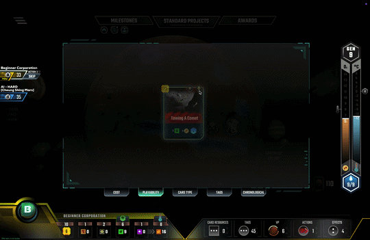

# Terraforming Mars: skip the turn animations (macOS + Windows)

A [BepInEx](https://github.com/BepInEx/BepInEx) plugin that adds quality-of-life
fixes and keyboard shortcuts to the Asmodee **Terraforming Mars** digital client
on macOS and Windows.

**Main thing it does: your turn starts instantly.** No more waiting on the
turn-pass animation and banner before you can play. A short sound still pings so
you know it's your turn.



Everything it does is **display / UI only**. The game is server-authoritative and
re-validates every real action, so the mod cannot make an illegal move, reveal
hidden information, or give any mechanical advantage; it only makes your own
client honest and quicker to drive.

> Personal project. Not affiliated with Asmodee / Lucky Hammers. Modifying an
> online client is against the game's ToS and is used here at your own risk.

---

## Install (easiest)

You need the game installed through **Steam** first. Then:

1. **Download the mod.** Get the ZIP from the
   [latest release](https://github.com/andrii-solokh/terraforming-mars-skip-animations/releases/latest)
   (under **Assets**).
2. **Unzip it** (double-click the downloaded file).
3. **Double-click the installer** for your computer, inside the unzipped folder:
   - **macOS:** `Install (macOS).command`
     (first time only: if it won't open, right-click it, choose **Open**, then
     **Open** again).
   - **Windows:** `Install (Windows).bat`
4. **Play:**
   - **macOS:** double-click `Launch TFM (modded).command` (with Steam open).
   - **Windows:** just launch Terraforming Mars from Steam as usual.

The installer finds your game automatically, downloads the loader, and installs
the mod. That's it. To go back to the normal game on macOS, launch from Steam
instead of the Launch file; on Windows, see [Uninstall](#uninstall).

The manual steps below are only if you want to do it by hand or the installer
can't find your game.

## Requirements

- macOS (Apple Silicon or Intel) **or** Windows (64-bit).
- Terraforming Mars installed via **Steam** (app id `800270`).
- macOS only: the game runs under **Rosetta (x86_64)** so the mod can load (the
  installer handles this automatically). Windows needs no such workaround.
- Only to **rebuild** the plugin: the [.NET SDK](https://dotnet.microsoft.com/download)
  (`dotnet`).

## Manual install (macOS)

The `Install (macOS).command` above just runs this for you.

```sh
git clone <this-repo-url> tfm-card-refresh-mod
cd tfm-card-refresh-mod
./setup.sh
```

`setup.sh` downloads BepInEx, applies the macOS fixes, drops `steam_appid.txt`,
and installs the plugin. Then launch modded one of two ways (Steam must be
running):

- **Steam launch option** — Library → Terraforming Mars → Properties → General →
  Launch Options:
  ```
  "/Users/<you>/Library/Application Support/Steam/steamapps/common/Terraforming Mars/run_bepinex.sh" %command%
  ```
- **Or** double-click **`Launch TFM (modded).command`**.

Launch **normally from Steam** (no launch option) any time you want the stock
game — the mod files sit inert unless launched through `run_bepinex.sh`.

## Manual install (Windows)

The `Install (Windows).bat` above does all of this for you. To do it by hand:
Windows needs none of the macOS injection workarounds (no Rosetta, no shell
scripts). Stock BepInEx auto-injects when you launch the game normally.

1. Download **BepInEx 5 (x64, Windows)**: the `BepInEx_win_x64_5.4.x.zip`
   asset from the [BepInEx releases](https://github.com/BepInEx/BepInEx/releases).
   Do **not** use BepInEx 6; it does not finish loading on this Unity 6 build.
2. Find the game folder: Steam → Terraforming Mars → right-click → Manage →
   **Browse local files**. You should see `TerraformingMars.exe`.
3. Unzip the BepInEx archive **into that folder** (so `winhttp.dll` and the
   `BepInEx\` folder sit next to `TerraformingMars.exe`).
4. Launch the game once from Steam, then quit — this makes BepInEx create its
   `BepInEx\plugins\` folder.
5. Copy **`TfmCardRefresh.dll`** into `BepInEx\plugins\`.
6. Launch from Steam normally. No launch option is needed.

To play the **stock** game, temporarily rename or remove `winhttp.dll` from the
game folder (or delete `BepInEx\`).

> Number badges use **Ctrl** on Windows (the same key as Cmd on macOS): e.g.
> `Ctrl`+`1` to use the first numbered card. Everything else is identical.

### Confirm it loaded

`BepInEx/LogOutput.log` in the game folder should end with:

```
Loading [TFM Card Playability Refresh 1.0.0]
TFM Card Playability Refresh 1.0.0 loaded.
Harmony patches applied ...
Chainloader startup complete
```

## Features

1. **Skip the turn-pass animation and banner** so your turn starts instantly, with
   a short sound so you still notice (the headline feature, shown above).
2. **Read your hand during opponent turns.**
3. **Cards you can't play are dimmed**, accounting for requirements and whether you
   can actually afford them (steel/titanium/heat/money), not just the tags.
4. **Card view re-checks playability** on state change (no close/reopen).
5. **Projects open on your turn**, and the hand reopens after you play a card.
6. **Action availability shown off-turn** (unused actions active, used ones dim).
7. **Full keyboard control** (see Hotkeys below): every panel and action on the
   Cmd/Ctrl layer, Space to confirm, `Esc` to cancel (presses **No / Close** on a
   confirm dialog).
8. **Number/letter badges to click by keyboard** — hold Cmd/Ctrl and the on-screen
   choices light up: cards in hand or a picker (`1`–`4`, `Q W E R`), standard
   projects / milestones / awards rows, and the hand's sort tabs (`5`–`9`). Press
   the badge to activate that item.
9. **Live scoreboard** (`Tab`) — a panel in the top-right showing every player's
   current victory points, broken down by source (Terraforming Rating, Awards,
   Milestones, Greenery, City, Card VP) with the total, sorted, your row marked.
   Computed exactly like the game's end screen but read-only: it reflects the
   standings *as if the game ended now* and never affects play.

## Hotkeys

Almost everything lives on the **Cmd/Ctrl layer** now. The only bare keys are
Space, Esc, the arrows, `Tab`, and `1`–`5`.

> **macOS:** use **Ctrl** (not Cmd) for these combos. `Cmd+Q/W/H/M` etc. are
> system shortcuts (quit / close / hide / minimise) and never reach the game. The
> mod accepts Ctrl and Cmd equally, so Ctrl is the safe choice on a Mac.

**Bare keys**

| Key | Action |
|-----|--------|
| Space | Confirm the SELECT ONE / dialog Yes-OK / focused card, else pass / end turn |
| Esc | Cancel: press No / Close on a confirm dialog, else hide the mod's panels |
| ↑ ↓ ← → | Navigate a choice list; ← → also page cards |
| Tab | Toggle the live scoreboard |
| 1–5 | Focus a player's board (1 = you, then the others) |

**Hold Cmd/Ctrl** (badges and letter-hints appear on screen while held):

| Key | Action |
|-----|--------|
| `1` `2` `3` `4` `Q` `W` `E` `R` | Play / use the 1st–8th on-screen card, action, or standard project / milestone / award (page for more) |
| `5`–`9` | Select the hand's sort/filter tabs (Cost, Playability, Card Type, Tags, Chronological) |
| C | Projects (hand) |
| A | Actions |
| R | Resources |
| V | Victory points |
| E | Effects |
| T | Tags |
| M | Milestones tab |
| K | Standard Projects tab |
| W | Awards tab |
| S | Sell cards (opens Sell Patents; Space confirms) |
| B | View state (inspect board) / Return |
| H | Toggle the on-screen shortcut overlay |
| G | Convert plants → greenery |
| F | Convert heat → temperature |

The card keys map left-to-right to the cards in view: the number row for the
first four, the `Q W E R` row for the next four (closer than reaching for `5`–`8`).
Where a key names both a card slot and a panel (W/E/R), the card wins while cards
are on screen; otherwise it opens the panel. Conversions only fire when you can
actually convert (enough resources, your turn).

### Live scoreboard (`Tab`)

Press `Tab` to toggle a panel in the top-right showing every player's current
victory points, split into the same columns as the game's end screen: Terraforming
Rating, Awards, Milestones, Greenery, City, Card VP, and Total. Your row is marked
with `▸` and rows are sorted by total. Awards and milestone leads reflect current
standings (what you'd score *if the game ended now*), so they shift as the board
changes. It only reads game state, computing the same numbers the game does, so it
never affects play or unlocks achievements.

## Config (toggle features / rebind keys)

Every feature and key is configurable. Launch the game once with the mod, then
edit:

```
BepInEx/config/com.experiment.tfm.cardrefresh.cfg
```

- `[Keys]` — rebind any shortcut. Values are Unity `KeyCode` names (e.g. `P`,
  `Space`, `UpArrow`, `Keypad1`). Change and relaunch.
- `[Features]` — turn any feature `true`/`false`: `Hotkeys` (master switch),
  `SuppressAnnouncements`, `KeepHandOpenOffTurn`, `AutoOpenHandAfterPlay`,
  `DimUnplayableInHandView`, `ShowActionAvailabilityOffTurn`,
  `SortUsableActionsFirst`, `HandReadableOffTurn`, `CardRefresh`,
  `PlayTurnStartSound` (ping when your turn begins, even with announcements
  hidden). `TurnStartSound` picks the sound id (e.g. `SFX_OTHER_PLAYER_TURN`,
  `SFX_MENU_CONFIRM`, `SFX_POPUP_OPEN`).

Config changes take effect on the next launch. In-game, press **H** for a quick
overlay of the current key bindings.

## Rebuild after a game update

A game patch can rename the classes the plugin hooks. Rebuild against the updated
game DLLs:

```sh
./build.sh          # macOS: recompiles and reinstalls to BepInEx/plugins/
```

On **Windows**, rebuild with the .NET SDK and copy the result into the game
folder (adjust the game path if yours differs):

```powershell
dotnet build TfmCardRefresh5.csproj -c Release ^
  -p:GameManaged="C:\Program Files (x86)\Steam\steamapps\common\Terraforming Mars\TerraformingMars_Data\Managed" ^
  -p:BepInExCore="C:\Program Files (x86)\Steam\steamapps\common\Terraforming Mars\BepInEx\core"
copy bin\Release\TfmCardRefresh.dll "C:\Program Files (x86)\Steam\steamapps\common\Terraforming Mars\BepInEx\plugins\"
```

Either way it errors on anything that moved so you know what to fix. Patches are
wrapped in try/catch and fail safe, so a stale patch goes silent rather than
crashing the game.

## Uninstall

- **macOS**: delete from the game folder: `BepInEx/`, `libdoorstop.dylib`,
  `run_bepinex.sh`, `.doorstop_version`, `steam_appid.txt`. Clear the Steam
  launch option if set.
- **Windows**: delete from the game folder: `BepInEx\`, `winhttp.dll`,
  `.doorstop_version` (and `doorstop_config.ini` if present).

## Why it's set up this way

- **BepInEx 5.4.23.5** (universal macOS). The 6.x bleeding-edge did not complete
  its chainloader on this Unity 6 build.
- **Forced x86_64 / Rosetta** — doorstop's Mono hook does not fire on this game's
  Unity 6.0.62 **arm64** runtime, but works under x86_64.
- **Absolute doorstop path** — `arch -e` strips `DYLD_LIBRARY_PATH`, so a bare
  `libdoorstop.dylib` name aborts the process at launch.
- **`steam_appid.txt` + `SteamAppId`** — stop `SteamAPI_RestartAppIfNecessary`
  from relaunching the game through Steam, which would spawn a fresh process
  without the mod.

## Files

| File | Purpose |
|------|---------|
| `Install (macOS).command` | Double-click installer (macOS) |
| `Install (Windows).bat` | Double-click installer (Windows) |
| `install-windows.ps1` | Windows installer logic (called by the `.bat`) |
| `Launch TFM (modded).command` | Double-click launcher (macOS) |
| `TfmCardRefresh.dll` | Prebuilt plugin |
| `setup.sh` | macOS installer (the `.command` runs this) |
| `run_bepinex.sh.working` | BepInEx launcher template with the macOS fixes |
| `build.sh` | Rebuild + reinstall the plugin (macOS) |
| `Plugin.cs` | Plugin source (all features + hotkeys) |
| `TfmCardRefresh5.csproj` | Build project (references the local game + BepInEx DLLs) |
